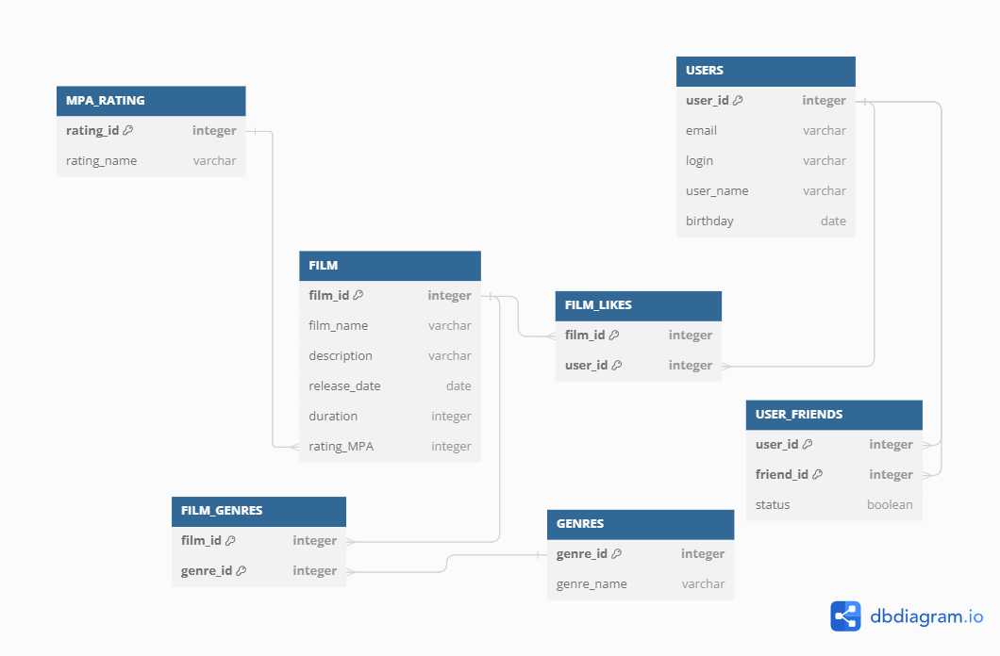

# java-filmorate
Бэкенд для сервиса, который будет работать с фильмами и оценками пользователей, а также возвращать топ фильмов, рекомендованных к просмотру.
#### Схема БД filmorate

##### Реализованные эндпоинты:
1. Пользователи
* POST /users - создание пользователя
* PUT /users - редактирование пользователя
* GET /users - получение списка всех пользователей
* GET /users/{id} - получение информации о пользователе по его id
* PUT /users/{id}/friends/{friend-Id} — добавление в друзья
* DELETE /users/{id}/friends/{friend-Id} — удаление из друзей
* GET /users/{id}/friends — возвращает список пользователей, являющихся его друзьями
* GET /users/{id}/friends/common/{other-Id} — список друзей, общих с другим пользователем
2. Фильмы
* POST /films - создание фильма
* PUT /films - редактирование фильма
* GET /films - получение списка всех фильмов
* PUT /films/{film-id}/like/{user-id} — пользователь ставит лайк фильму
* DELETE /films/{film-id}/like/{user-id} — пользователь удаляет лайк
* GET /films/popular — возвращает список из 10 самых популярных лайков 